# ArgoCD GitOps Platform

## Project Overview

This repository demonstrates a production-style GitOps workflow using ArgoCD and Kubernetes.

ArgoCD is deployed to a Kubernetes cluster and configured to continuously monitor the Git repository containing Kubernetes manifests. Any changes pushed to the repository are automatically reconciled by ArgoCD, keeping the cluster state aligned with the declared infrastructure and application configuration.

The project highlights:
- automated deployments with ArgoCD
- GitOps-driven application delivery
- Kubernetes application lifecycle management
- infrastructure-as-code best practices

## Repository Structure

- `manifests/` - Kubernetes manifests for the sample application and ArgoCD configuration
- `screenshots/` - visual artifacts documenting the deployment, login, sync, and validation stages

## Screenshots

The `screenshots/` folder contains visual documentation for the ArgoCD workflow. Each image is sized for effective display on GitHub.

<table>
  <tr>
    <td align="center">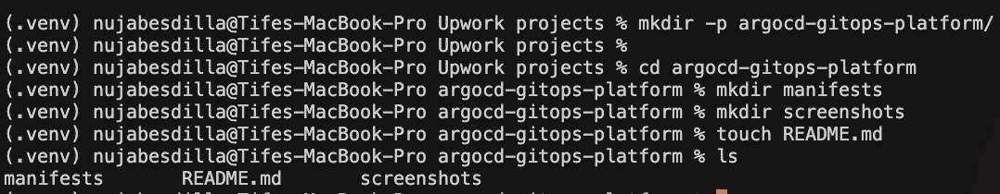 <strong>01</strong> Project structure</td>
    <td align="center">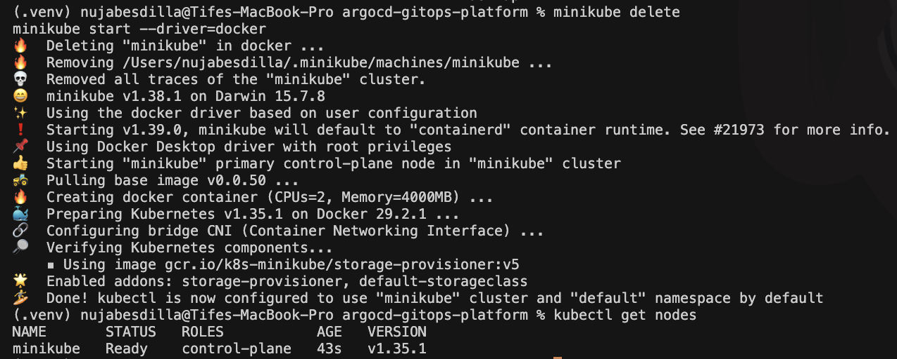 <strong>02</strong> Minikube status</td>
    <td align="center">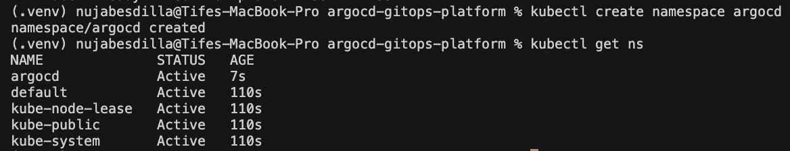 <strong>03</strong> ArgoCD namespace</td>
  </tr>
  <tr>
    <td align="center">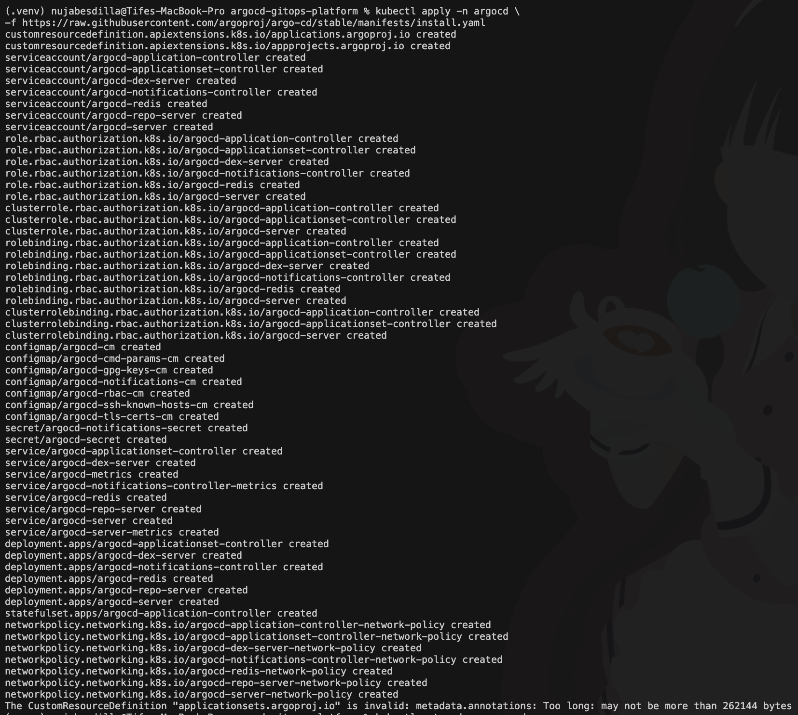 <strong>04</strong> ArgoCD pods</td>
    <td align="center">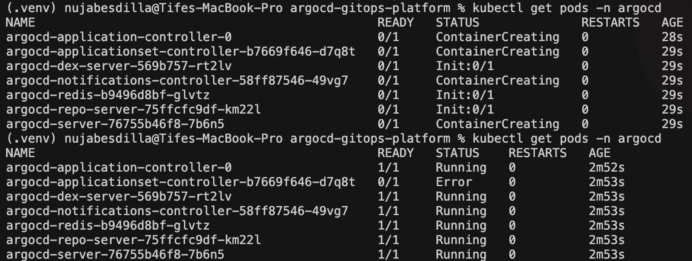 <strong>05</strong> Namespace details</td>
    <td align="center">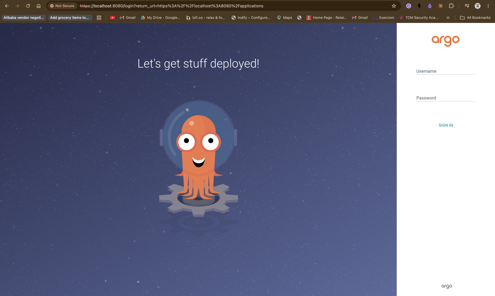 <strong>06</strong> ArgoCD login</td>
  </tr>
  <tr>
    <td align="center">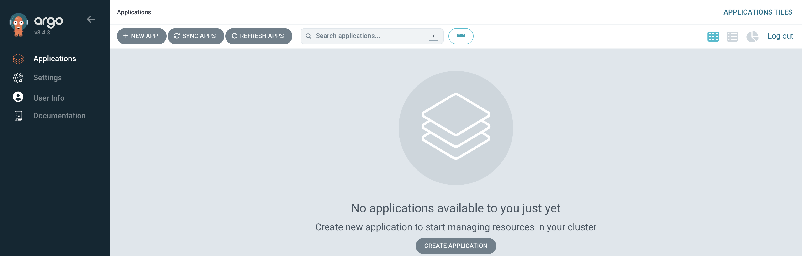 <strong>07</strong> ArgoCD dashboard</td>
    <td align="center">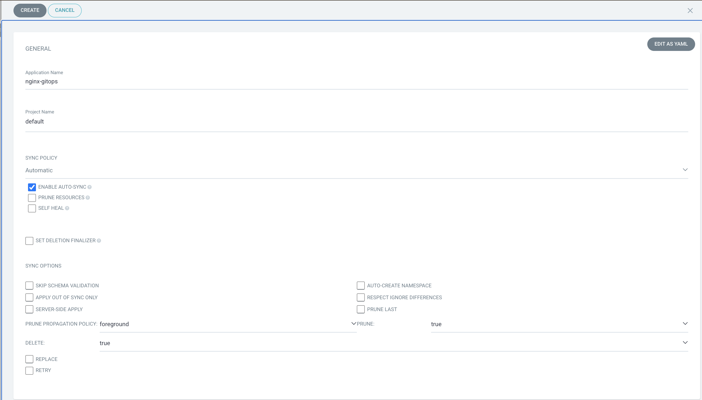 <strong>08</strong> Application created</td>
    <td align="center">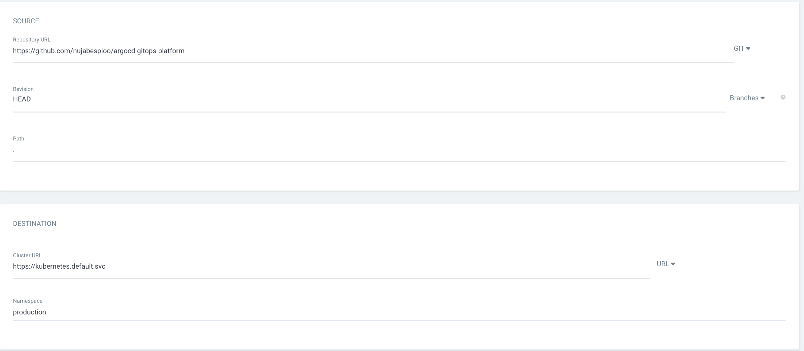 <strong>09</strong> Application details</td>
  </tr>
  <tr>
    <td align="center">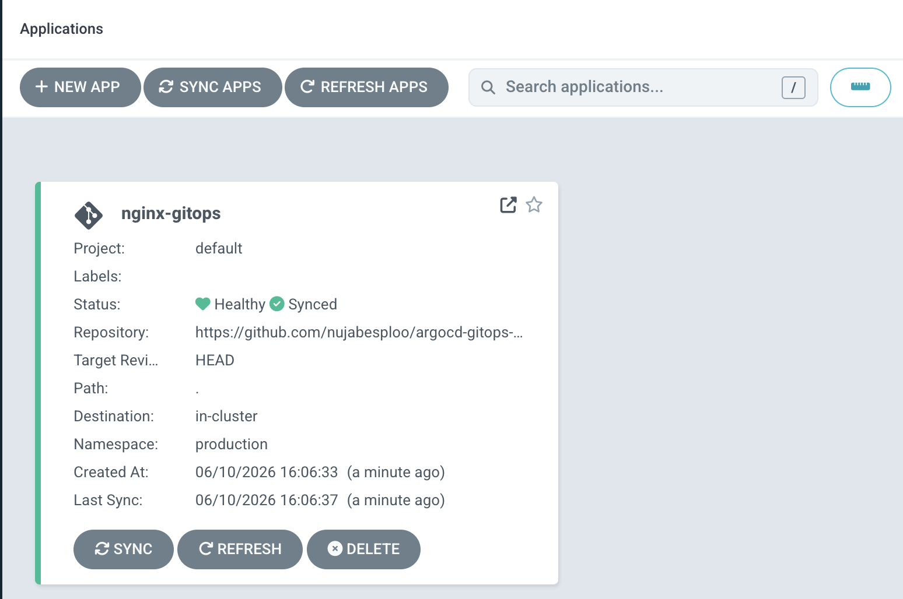 <strong>10</strong> Sync success</td>
    <td align="center">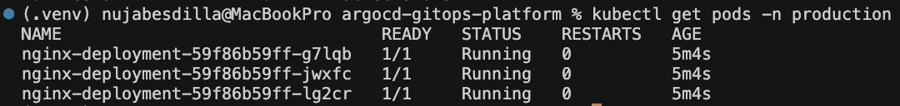 <strong>11</strong> Production pods</td>
    <td align="center">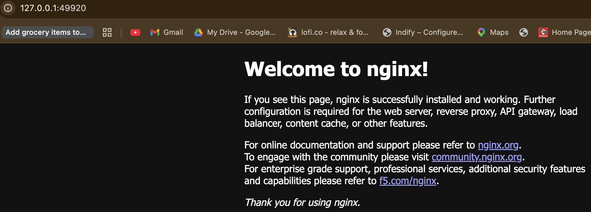 <strong>12</strong> Browser validation</td>
  </tr>
</table>

## Usage

1. Deploy ArgoCD to a Kubernetes cluster.
2. Connect ArgoCD to this Git repository.
3. Create and synchronize the application from the ArgoCD dashboard.
4. Verify the application deployment and pod status in Kubernetes.

This README is intentionally concise and focused on the project deliverables. No personal or sensitive information is included.